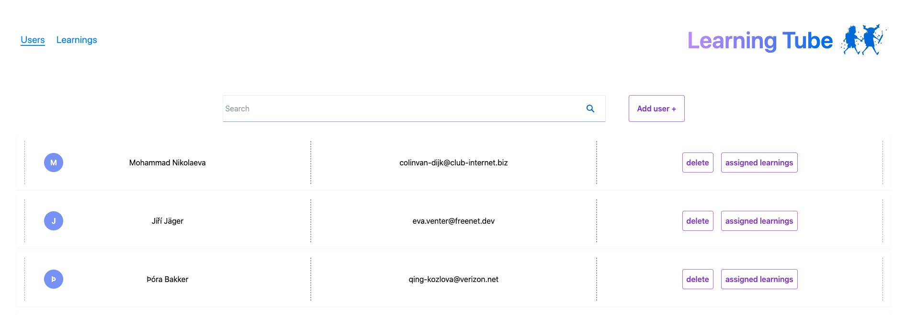
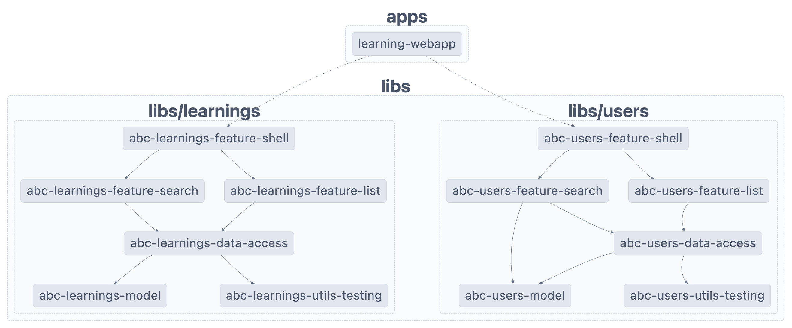

# Organize nx libs article demo

## Project graph

This project was generated using [Nx](https://nx.dev).

#### How to run the project:
1. `npm install`
2. Create the fake data
	`npx tsx generate-fake-data.ts > db.json`
 3. Run the server 
	 `npx json-server --watch db.json --port 3000`   
 4. Run the client
	 `npm run start`

#### How to run the unit tests:
`npx nx test learnings-data-access`
`npx nx test users-data-access` 

